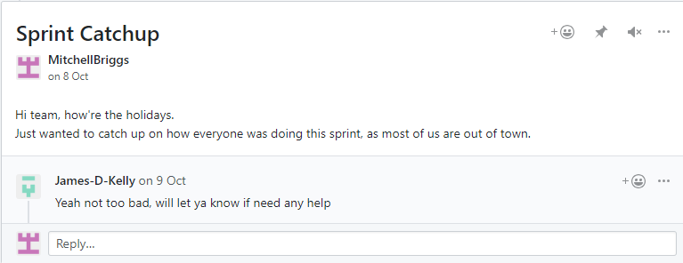
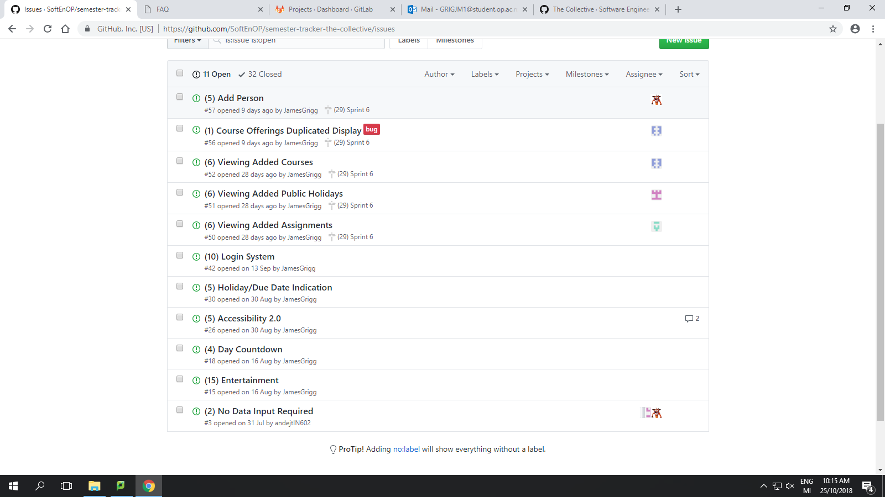
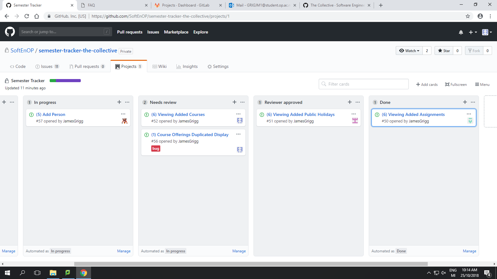
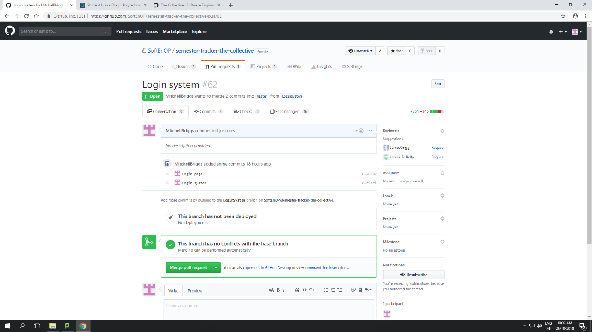

[Download files][download-file]
[download-file]: "Mitchell Briggs - Resume.doc"

# Portfolio
Thinking about this semester, I thoroughly enjoyed working on the software project. Throughout this project, some valuable aspects I learnt were, how to properly form a new team, how they function in a working environment, and how to handle conflicts between team members. Furthermore, I also learnt a lot about the use of laravel, creating login systems, and a little javascript as well.

## Sprint 1

In the first sprint, we were tasked with the creation of a project team. Within this first sprint, we were able to get to know new people, learn aspects about them and their work habits. This was our first attempt at actual project group work, so we could see how things went, and how everyone would work as a team. However, after our first sprint, we lost a team member. This meant that we would all have to increase our workloads to keep up with the demands from the client. After this sprint, I attempted to get to know the team, learn more about everyone. During this sprint, we worked out that we needed to come together more outside of class time, as it was one of the major downsides of the sprint. We also realised that we were doing more work than necessary and weren’t meeting the client’s wishes. This was due to a lack of communication with the client about what they expected to see. Therefore as a team, we need to start not only speaking more to each other but with the client as well.

## Sprint 2

Because of the way the client wanted the semester dates to appear, it meant I had to learn how to code some minor javascript. This was due to the way the client wanted the days for the semester to show up. This meant that I had to go outside of class to learn how to code some javascript to make the days appear/disappear. After our last sprint, we learnt that we needed to communicate more with the team/client. We started talking about the project in class on days where we didn’t come together as a project team so that we could keep up to date with how everyone was doing. I also spoke to the client inside and outside of class time, just to make sure the way I was doing it was exactly how they wanted. As part of this sprint, one of our team members didn’t do their work till the last week, it meant I had to complete their work for them. This wasn’t too much of a hassle as it just meant I had to learn a little bit more javascript, as I had already learnt most of it for my part of the sprint. As I had learnt javascript for the sprint, I will be able to transfer that into any other work that I need javascript for. After speaking with the client, and realising how much it eased confusion around my part in the sprints, I will continue doing this so that I’m sure of what I need to do. As for my teammate that didn’t complete their work, I kept an eye on them to make sure we get their work done. I also had a conversation about why they wouldn’t get their work done, just to make sure that they weren’t slacking off.

## Sprint 3

As a big part of the project, we had to learn how to use laravel. This meant we had to go through a few tutorials on how to set up a laravel project, and then how to use laravel. One of the biggest struggles we had through this sprint, was learning how everything in laravel worked. For example, how we set up models, how we used and manipulated views depending on what data we passed into the view. Most of the struggle came due to some of our team members not actually understanding how to use laravel. By understanding how this process worked, I helped them through the tutorial and the concepts to the best of my ability. As most of our group had at least a basic understanding of laravel, we are able to move forward with the group project. As I know the most about laravel I will try and help my teammates as much as I can, so that they are able to complete their work. 

## Sprint 4

As we began doing more and more work with laravel we encountered more and more problems with the specific syntax that laravel uses. Most of the issues revolved around the site being able to link back to itself, as we needed some pages where we added something to link bac. This issue couldn’t even be solved by our lecturer, which made it even harder for us to complete work. However, with some time and effort outside of class, I was able to find a solution to the issue. Another big issue with the sprint was one of our team members’ still not doing work. This just makes it more difficult for the rest of our team, as we must not only worry about the work we’re doing but also worry if the teammate was going to finish their work. As we have now gone through most of what could go wrong with laravel, I feel more prepared to handle any issues that may arise with laravel. However, I can only help people if they ask for it. This leads to one of the main issues with sprint, which is the lack of commutation between the teammates who need help and those who can provide it. This sprint went well for us, but as the holidays are coming, I feel the lack of communication we have is going to hurt our chances of getting all our work done.

## Sprint 5

Over the holidays we had a small sprint so that people could just get work done over the holidays without stressing about it too much. However, due to myself and one of the other team members being out of town, it made it extremely difficult to communicate with each other to make sure we got everything done. In Figure 1, I put a post in the GitHub wiki asking people how everything was going and only got one response 2 days before sprint was due. This meant I had no idea how everyone was doing. I managed to get in contact with one of the two that hadn’t responded, and he said he would get his work done on time, but one member never responded. Because of this, we assumed that they weren’t going to get their work done and did it for them. Over this sprint, I was tasked to show the semesters that we added to the database. This meant I had to learn how the laravel syntax for both retrieving data, and then passing it into a view. This has allow me to feel more prepared to handle working with laravel and managing and creating a database within laravel. I also feel like I am prepared to manage views within laravel. With the conclusion of the sprint, and coming back from the holidays, we found out that the team member that never responded was unable to complete their work, nor respond because they came down with a bad illness. The only issue with this is that they haven’t done any work for the past 3 sprints, so I wonder if they had any intention of finishing their work.

## Sprint 6

We had a shorter sprint this time, as we wanted to have everyone together before we gave everyone work. This meant we had less time to work on the project for the sprint, but we took that into account when we decided what we wanted to work on. To account for this, we took work that wouldn’t take as much too complete compared to other stuff. We did this as a team, by deciding how much effort/work each issue would take, and then assigning the issue a number. By doing this we were able to keep up with our workload, during the shorter time. Another big part of the sprint was helping the team member, which had done barely any work, complete the tutorial to laravel so that they were able to add and view people on the website. This took a whole class, but we were able to get him to a point where he was happy with how the new addition to the website looked/worked. The third part of this sprint was unit testing. Unit testing was introduced to us to test a large part of our project automatically. However, the tutorial that our lecturers gave us, was completely out of date, so we couldn’t use it. Since we were able to plan out this sprint quite well, we will hopefully be able to carry that into our next sprint. Planning how much work we could complete made it so much less stressful when it came to the end of the sprint. This was because we were all given manageable amounts of work so that if our team member didn’t complete their work again, we would be able to manage that. In Figures 2 and 3, it shows us using GitHub to manage the amount of work, and how complete it was, and in Figure 4 it shows how a completed user story/stories were merged into the master branch.

## Sprint 7

As this was the final sprint, we decided to that it was time to complete any other user stories that we had left. This meant just cleaning up anything that was yet to be done. As we only had a few stories left undone, we managed to complete all but two. After completing the sprint, our whole team was happy with how the website looked and ran. The only issue we had this sprint was our team member went back to not completing work again. This is unfortunate because it meant that they haven’t done any work for 4 out of 7 of the sprints that we’ve done. The only thing we had left to do at this point was to completely clean up the website, by adding padding and improving the mobile usage of the site. For this sprint, I was tasked with creating a login system for the website. Luckily enough, we had already done something similar in one of our other classes. So, I was able to just use what had already been created and implemented it into our website. While it was easy to implement something that had already been done, there came an issue when I tried to deploy it on the live server. Laravel wouldn’t tell me what was wrong, it just kept saying “whoops something went wrong”. After consulting my lecturer about it, they told me to go and check the laravel logs. The issue happened to only be that one of our database tables were out of date. From this, I was able to learn how to not only integrate an already created technology into something we were just learning but also how to bug fix it when it all goes wrong. As we had pretty much completed the project at this point, all we had left to do was to tidy stuff up. Therefore, people just going in and padding each of the pages so that the input fields aren’t touching the extreme edges of our site, and just some other touch up things so that our site looked presentable. We realised as a group that we had to organise who would do what, and then communicate who was going to do what.

I think the project went well. We worked well as a team, for the most part. Even though there was a lack of communication from one of our team members, I tried to provide leadership and help to the team. Looking back, one aspect to work on would be to improve communication with my fellow team members on the webpage. I personally really enjoyed learning how to use laravel, and the small amount of javascript that I learnt. I also enjoyed implementing the login system into the website. I feel like it was a major part of the project, as it controls what the user can view/see. I did struggle through a lot of issues with team members, and software/hardware.  However, at the end of this project, I believe that from what I learnt through the entire process I am more prepared to handle these kinds of situations in the future.


## References

Figure 1: Screenshot from GitHub Discussions

Figure 2: Our backlog with in-progress tickets

Figure 3: The Kanban board showing where in progress the tickets where

Figure 4: Merging the login system into the main program

You can use the [editor on GitHub](https://github.com/MitchellBriggs/Portfolio/edit/master/index.md) to maintain and preview the content for your website in Markdown files.

Whenever you commit to this repository, GitHub Pages will run [Jekyll](https://jekyllrb.com/) to rebuild the pages in your site, from the content in your Markdown files.

### Markdown

Markdown is a lightweight and easy-to-use syntax for styling your writing. It includes conventions for

```markdown
Syntax highlighted code block

# Header 1
## Header 2
### Header 3

- Bulleted
- List

1. Numbered
2. List

**Bold** and _Italic_ and `Code` text

[Link](url) and 
```

For more details see [GitHub Flavored Markdown](https://guides.github.com/features/mastering-markdown/).

### Jekyll Themes

Your Pages site will use the layout and styles from the Jekyll theme you have selected in your [repository settings](https://github.com/MitchellBriggs/Portfolio/settings). The name of this theme is saved in the Jekyll `_config.yml` configuration file.

### Support or Contact

Having trouble with Pages? Check out our [documentation](https://help.github.com/categories/github-pages-basics/) or [contact support](https://github.com/contact) and we’ll help you sort it out.
